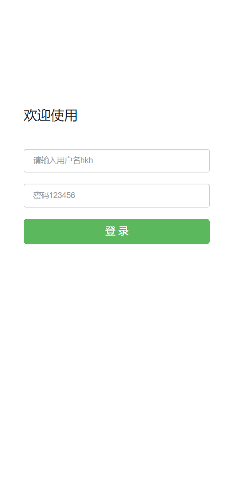
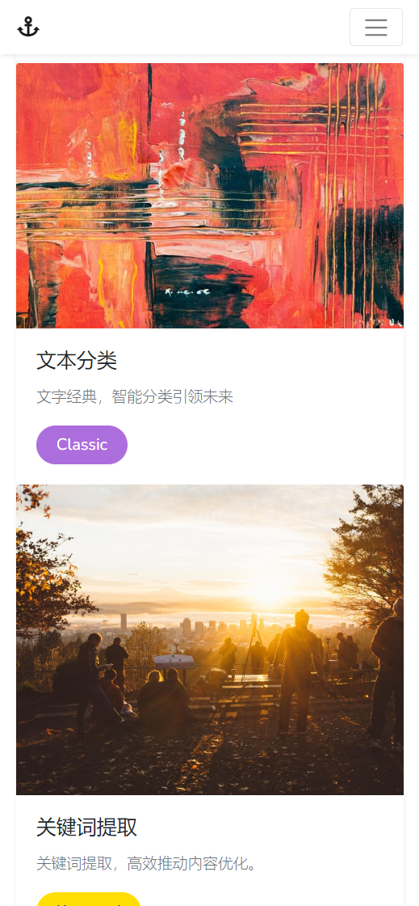
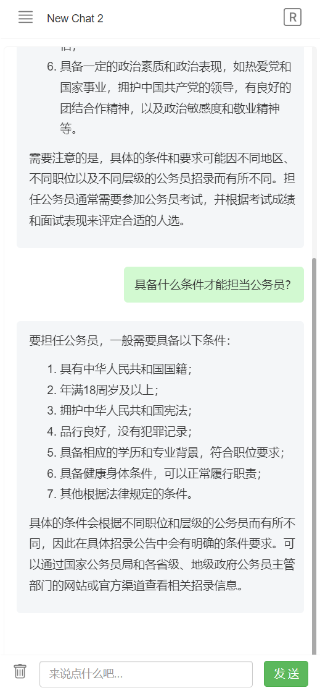
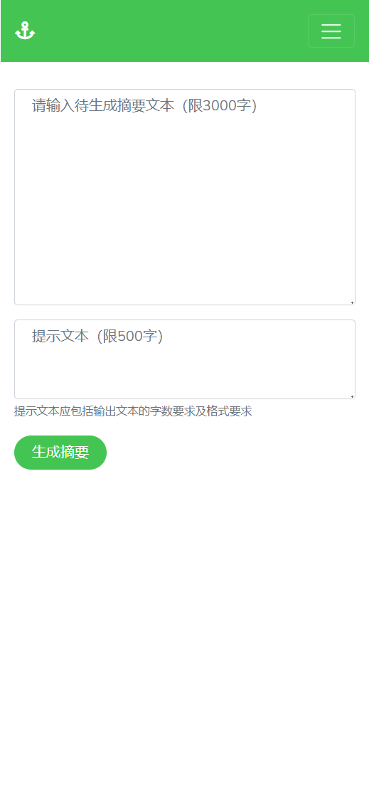

# langchain-springboot
用langchain的思想，构建SpringBoot AI应用。

🚩 本项目未涉及AI模型的微调、训练过程，仅使用相关大语言模型作为技术底座实现相关功能，模型的使用请参看相关官方文档。

## 涉及技术栈
| 组件           | 版本                                           | 
|--------------|----------------------------------------------|
| java         | 17+                                          | 
| SpringBoot   | 3.1.0                                        | 
| swagger-ui   | knife4j-openapi3-jakarta-spring-boot-starter | 
| 工具包          | hutool-all                                   | 
| 缓存           | redis                                        | 
| json         | fastjson2                                    | 
| mysql        | mysql-connector-j                            | 
| orm框架        | mybatis-plus                                 | 
| openai库      | openai-java                                  |
| 前端           | freemarker、bootstrap、jquery                  | 
| stream-chat  | SSE                                          | 
| LLMs         | openai、chatglm2、文心一言                         | 
| embeddings   | openai、text2vec-transformers、文心一言            |
| vector store | weaviate、milvus                                    |

## langchain 原理


## 路线图
已完成本地知识库上传、及完成openai、chatglm2两个LLMs模型流式聊天功能。未来计划会接入更多大语言模型，以满足更多需求场景。
- [ ] Langchain 知识库
    - [x] 接入非结构化文档（已支持 md、pdf、docx、txt、csv 等文件格式）
    - [ ] 搜索引擎接入
    - [ ] 结构化数据接入（如Excel、SQL 等）
    - [ ] 知识图谱/图数据库接入
- [ ] 增加更多 LLM 模型支持
    - [x] [OPENAI](https://platform.openai.com/docs/api-reference)
    - [x] [THUDM/chatglm2-6b](https://huggingface.co/THUDM/chatglm2-6b)
    - [x] [百度/文心一言](https://cloud.baidu.com/doc/WENXINWORKSHOP/s/clntwmv7t)
    - [ ] [THUDM/chatglm-6b](https://huggingface.co/THUDM/chatglm-6b)
    - 
- [ ] 增加更多 Embedding 模型支持
    - [x] [OPENAI/embedding](https://platform.openai.com/docs/api-reference/embeddings)
    - [x] [weaviate/text2vec-transformers](https://weaviate.io/developers/weaviate/modules/retriever-vectorizer-modules/text2vec-transformers)
    - [x] [百度/文心一言](https://cloud.baidu.com/doc/WENXINWORKSHOP/s/dllz04sro)
    - [ ] [shibing624/text2vec-base-chinese](https://huggingface.co/shibing624/text2vec-base-chinese)
- [ ] 系统功能
    - [ ] 用户
      - [x] 用户登录
      - [ ] 用户注册
      - [ ] 第三方登录
    - [x] 基于 SSE 实现 Stream Chat
    - [x] 会话管理
    - [x] 知识库管理
    - [ ] 支持搜索引擎问答
- [ ] prompts相关功能
    - [x] 摘要
    - [x] 翻译
    - [x] 关键词
    - [x] 文本分类
    - [x] 内容安全
    - [x] 偏好分析
    - [ ] 查重
    - [ ] 文生图
- [ ] 前端
    - [x] 移动端适配
    - [x] 代码等内容流式输出优化

## Quick Start
### 1. 执行数据库脚本 
```sql
init-script/db.sql
```
### 2. 安装本地向量数据库
```dockerfile
-- 安装启动本地向量数据库
docker-compose up -d 
```
### 3. 大语言模型
```java
// 配置openai api token
openai.token=sk-xxxxxxxxxxxxxxxxxxxxxxxxxxxxxxxxxxxxx
```
```python
# 或者启动本地chatglm2-6B模型
python .\openai_api.py
```

## 功能展示
|  ||||
|--------------------------------------------------------------------------| ------ | ------ | ------ |
|||||
|||||

## 聊天Demo


本地知识库


## 项目交流群


🎉 langchain-springboot 项目微信交流群，如果你也对本项目感兴趣，欢迎加入群聊参与讨论交流。如群二维码已过期请扫我的个人二维码拉入群
