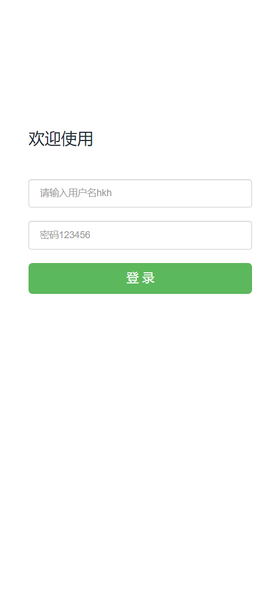
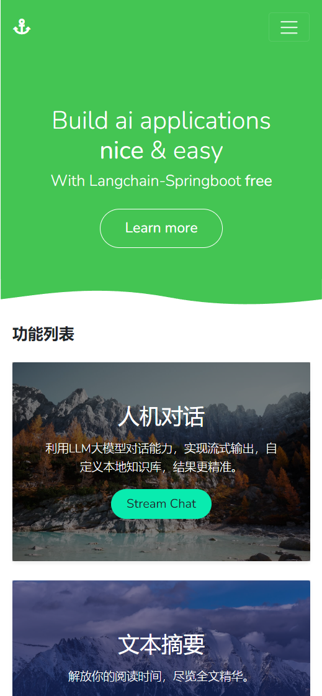
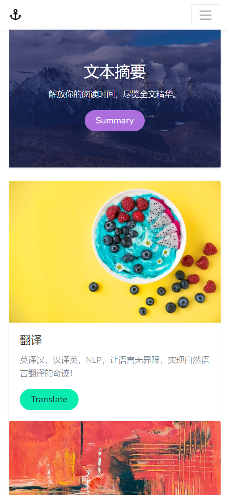
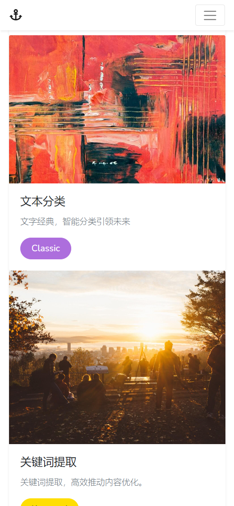
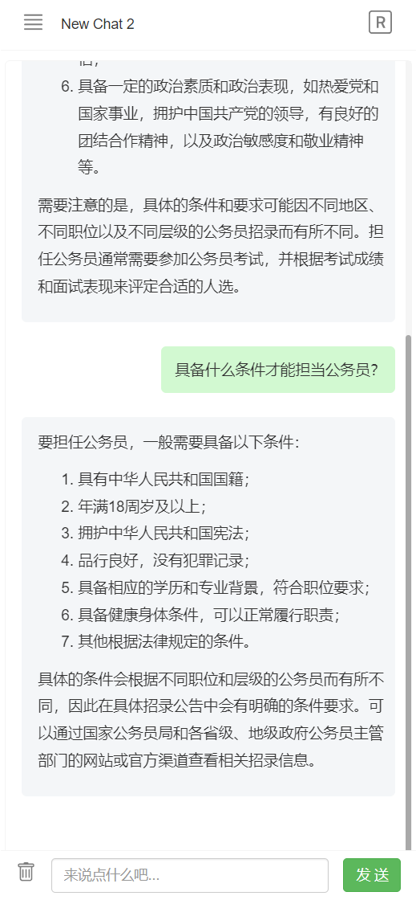
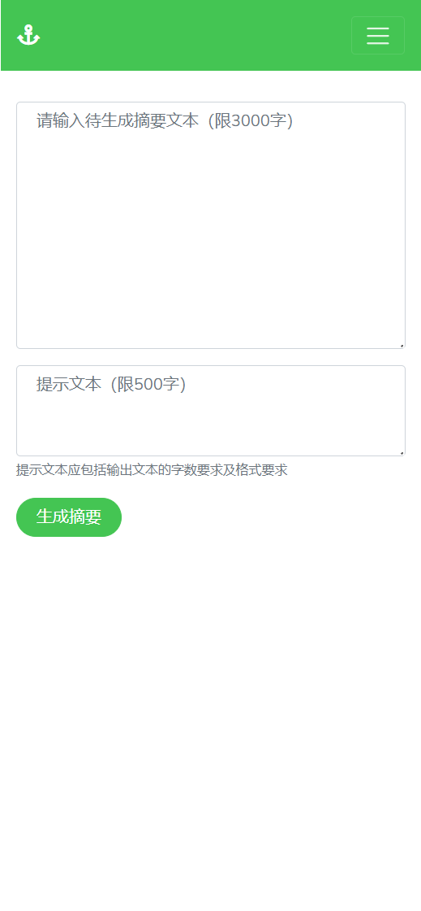
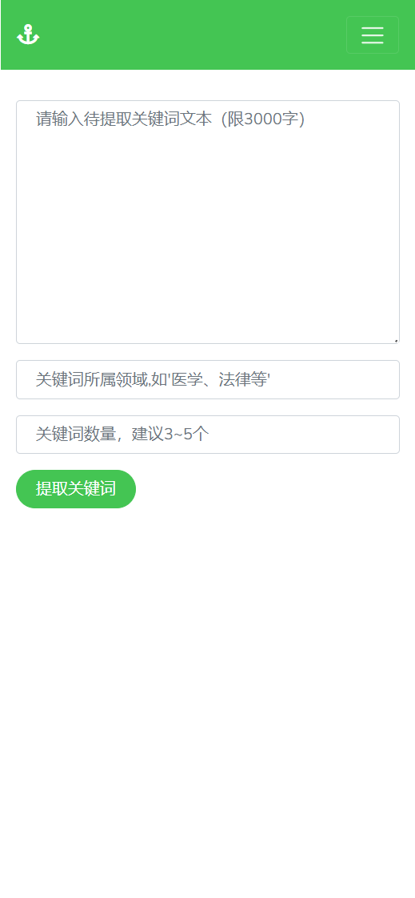
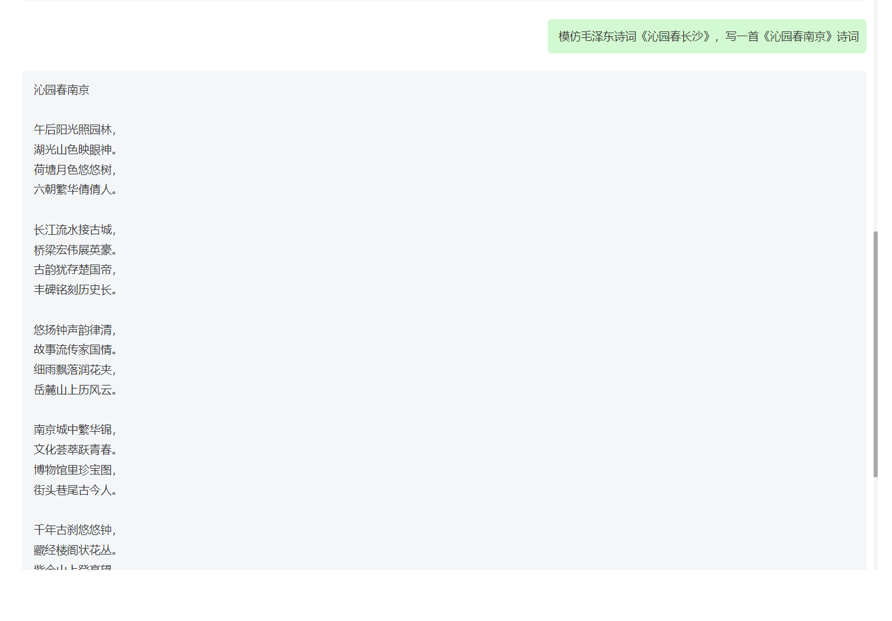
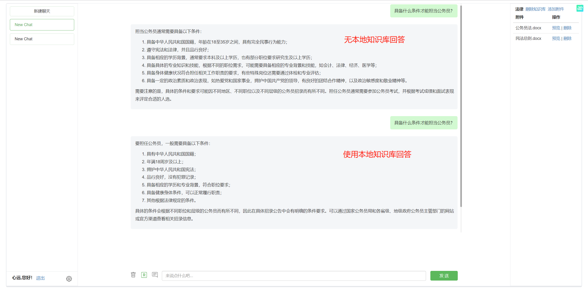
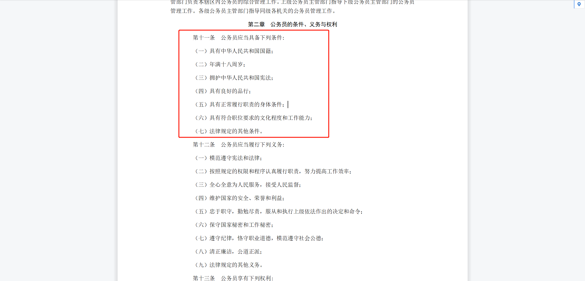

# LangBoot
用SpringBoot构建AI应用脚手架。

🚩 本项目未涉及AI模型的微调、训练过程，仅使用相关大语言模型作为技术底座实现相关功能，模型的使用请参看相关官方文档。

## 项目模块
| 模块                    | 描述      |
|-----------------------|---------|
| langboot-admin        | 管理端接口   |
| langboot-agent        | 智能体模块   |
| langboot-common       | 通用模块    |
| langboot-core         | LLM核心模块 |
| langboot-dependencies | 依赖定义模块  |
| langboot-domain       | 领域对象模块  |
| langboot-user         | 用户端     |

## 涉及技术栈
| 组件           | 版本                                           | 
|--------------|----------------------------------------------|
| java         | 17+                                          | 
| SpringBoot   | 3.1.0                                        | 
| swagger-ui   | knife4j-openapi3-jakarta-spring-boot-starter | 
| 工具包          | hutool-all                                   | 
| 缓存           | redis                                        | 
| json         | fastjson2                                    | 
| mysql        | mysql-connector-j                            | 
| orm框架        | mybatis-plus                                 | 
| openai库      | openai-java                                  |
| 前端           | freemarker、bootstrap、jquery、recorder.js      | 
| stream-chat  | SSE                                          | 
| LLMs         | openai、chatglm2、文心一言 、智谱AI、Kimi              | 
| embeddings   | openai、text2vec-transformers、文心一言            |
| vector store | weaviate、milvus、pgvector                     |

## langchain rag原理


## 模型能力矩阵
| 模型/能力     | 文本生成 | 流式输出 | 语音  | 函数调用 | 图片生成 | 多模态(VISION) | 嵌入EMBEDDING |
|-----------|-----------|-----------|-----------|-----------|------|-----------|-----------|
| openai    | 支持   | 支持   | 支持  | 支持   | 支持   | 支持          | 支持          |
| 百度(文心)    | 支持   | 支持   | -   | 支持   | 支持   | -           | 支持          |
| 智谱(GLM-4) | 支持   | 支持   | -   | 支持   | 支持   | 支持          | 支持          |
| kimi      | 支持   | 支持   | -   | -    | -    | -           | -           |
| chatglm2  | 支持   | 支持   | -   | -    | -    | -           | -           |
| ... ...   | -    | -    | -   | -    | -    | -           |-  |


## Quick Start
### 1. 执行数据库脚本 
```sql
init-script/db.sql
```
### 2. 安装本地向量数据库
```dockerfile
-- 安装启动本地向量数据库
docker-compose up -d 
```
### 3. 大语言模型
```java
// 配置openai api token
openai.token=sk-xxxxxxxxxxxxxxxxxxxxxxxxxxxxxxxxxxxxx
```
```python
# 或者启动本地chatglm2-6B模型
python .\openai_api.py
```

## 更多配置请查看

[Wiki](https://github.com/hkh1012/langboot/wiki)

[如何构建高质量知识库文档](https://github.com/hkh1012/langboot/wiki/How-to-build-a-high%E2%80%90quality-knowledge-base)

## 功能展示
|  ||||
|--------------------------------------------------------------------------| ------ | ------ | ------ |
|||||
|||||

## 聊天Demo


本地知识库


## 项目交流群


🎉 langboot 项目微信交流群，如果你也对本项目感兴趣，欢迎加入群聊参与讨论交流。如群二维码已过期请扫我的个人二维码拉入群
